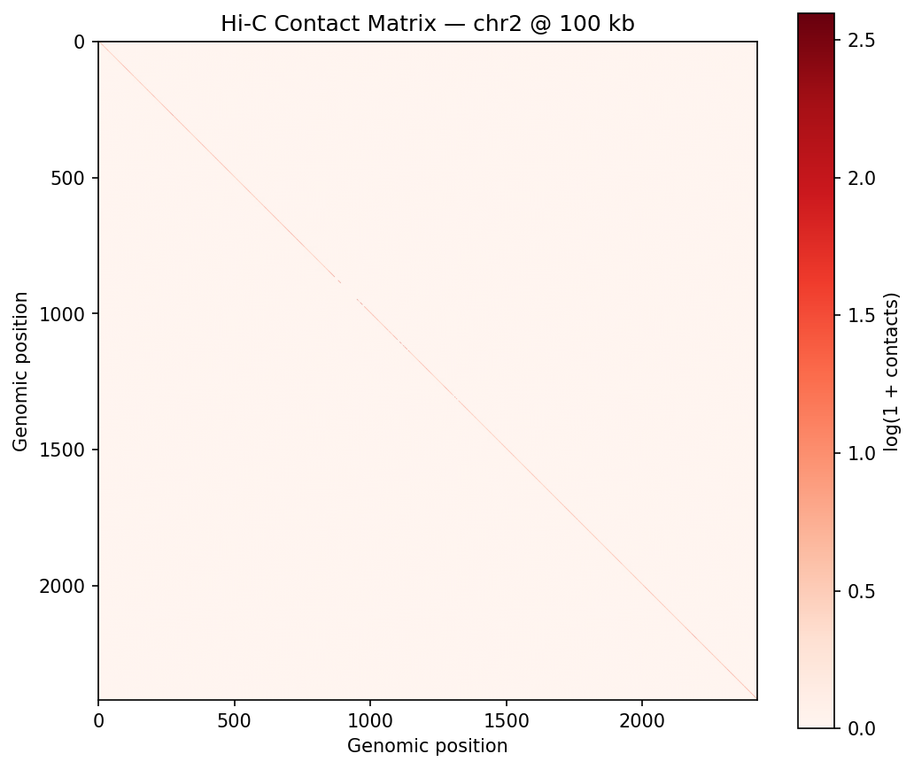

# Chromosome + Cell Mini-Pipeline

[](https://doi.org/10.5281/zenodo.18500690)
[](https://opensource.org/licenses/MIT)
[](https://www.python.org/downloads/)
[](https://github.com/mojo8787/chromosome-cell-pipeline/releases)
[](https://github.com/mojo8787/chromosome-cell-pipeline/actions/workflows/ci.yml)

A combined genomics and microscopy analysis pipeline demonstrating end-to-end Hi-C chromatin analysis and nuclei segmentation. Inspired by chromosome organization workflows; designed as a reproducible demo pipeline for Hi-C + microscopy analysis.

> *This is an independent demo project and is not affiliated with, endorsed by, or reviewed by IMBA or the Gerlich lab.*

## Overview

This repository contains two integrated pipelines:

1. **Hi-C Genomics Pipeline** — Load, QC, and visualize Hi-C contact matrices using [cooltools](https://cooltools.readthedocs.io/) and the [cooler](https://github.com/open2c/cooler) format (commonly used in Hi-C analysis; conceptually compatible with interactive exploration tools such as [HiCognition](https://www.hicognition.com)).
2. **Microscopy Pipeline** — Segment nuclei from fluorescence microscopy images using [StarDist](https://github.com/stardist/stardist), with feature extraction and visualization.

Both pipelines feed into a unified **Streamlit dashboard** for interactive exploration.

### Dashboard

The dashboard (`streamlit run app.py`) has three tabs:

- **Hi-C Explorer** — Interactive contact heatmap, distance-decay plot, and QC stats table
- **Nuclei Analyzer** — Nuclei features table, per-image summary stats, and segmentation overlays
- **About** — Quick reference and setup instructions

## Sample Outputs

**Hi-C contact matrix** (HFF Micro-C, chr2/chr17):



**Nuclei segmentation overlays** (BBBC039, U2OS Hoechst):


## Setup

```bash
cd chromosome-cell-pipeline
python -m venv .venv
source .venv/bin/activate   # Windows: .venv\Scripts\activate
pip install -r requirements.txt
```

### Optional: Conda (for cooltools compatibility)

```bash
conda env create -f environment.yml
conda activate chrom-cell
```

## Usage

### Quick start (all steps)

```bash
python scripts/04_generate_outputs.py   # Download + run both pipelines
streamlit run app.py
```

### Step by step

1. **Download data**
   ```bash
   python scripts/01_download_data.py
   ```
   Downloads HFF Micro-C (~145 MB) via cooltools and BBBC039 (~78 MB) from Broad Institute. Data is fetched at runtime; not included in this repo. See [Data Sources](#data-sources) for citations and terms.

2. **Run pipelines**
   ```bash
   python scripts/02_hic_pipeline.py
   python scripts/03_microscopy_pipeline.py
   ```

3. **Launch dashboard**
   ```bash
   streamlit run app.py
   ```

## Generated Outputs

| Pipeline | Outputs |
|----------|---------|
| **Hi-C** | `output/hic/heatmap.png`, `heatmap.html`, `distance_decay.html`, `qc_stats.csv` |
| **Microscopy** | `output/microscopy/nuclei_features.csv`, `summary_stats.csv`, `overlays/*.png` |

## Configuration

Key options in `config.yaml`:

- **Hi-C:** `resolution` (100 kb), `chromosomes` (chr2, chr17), `download_dataset`
- **Microscopy:** `subset_size` (20 images for demo; set to `null` for all), `stardist_model`

If StarDist or TensorFlow is unavailable, the microscopy pipeline falls back to watershed-based segmentation.

## Limitations

Demo pipeline; not optimized for production-scale datasets yet.

## Reproducibility

- **Tested:** Python 3.10+, macOS / Linux
- **Dependencies:** See `requirements.txt` (minimum versions; pin exact versions for strict reproducibility)
- **Expected runtime:** ~5–10 min for full pipeline (download + both analyses)
- **Memory:** ~2–4 GB peak

## What This Demonstrates

- **End-to-end pipelines** — Raw data → QC → analysis → visualization
- **Robust Python tooling** — Config-driven, documented, reproducible
- **Microscopy + genomics** — Bridges chromosome organization and quantitative image analysis
- **Standard Hi-C tooling** — Uses cooler format and cooltools workflows; designed for conceptual compatibility with interactive exploration tools such as HiCognition

## Data Sources

Datasets are **downloaded at runtime**; not redistributed in this repository.

| Dataset | Source | License / Terms |
|---------|--------|-----------------|
| **HFF Micro-C** | [cooltools](https://cooltools.readthedocs.io/) test data; 4D Nucleome / open2c ecosystem | 4DN data use policy |
| **BBBC039** | [Broad Institute](https://bbbc.broadinstitute.org/BBBC039) — U2OS nuclei, Hoechst stain | CC0 1.0 (public domain) |

**Citations:** BBBC — Ljosa V, Sokolnicki KL, Carpenter AE (2012). *Nature Methods* 9(7):637. HFF Micro-C — 4D Nucleome Consortium; see cooltools documentation.

## Project Structure

```
chromosome-cell-pipeline/
├── app.py              # Streamlit dashboard
├── config.yaml         # Paths and parameters
├── requirements.txt
├── environment.yml     # Optional conda env
├── CITATION.cff        # Citation metadata
├── docs/
│   └── sample_outputs/ # Example figures for README
├── scripts/
│   ├── 01_download_data.py
│   ├── 02_hic_pipeline.py
│   ├── 03_microscopy_pipeline.py
│   └── 04_generate_outputs.py
├── data/               # Downloaded (gitignored)
└── output/             # Generated figures (gitignored)
```

## Author

**Almotasem Bellah Younis** — [ORCID](https://orcid.org/0000-0003-2070-2811) · [GitHub](https://github.com/mojo8787)

## Citation

See [CITATION.cff](CITATION.cff) for citation metadata.

## License

MIT
